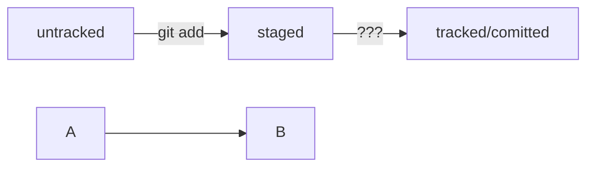

# platon-accs
Automatically exported from code.google.com/p/platon-accs

```mermaid
graph LR;
  untracked -- "git add" --> staged;
  staged    -- "???"     --> tracked/comitted;

%% стрелка без текста для примера: 
  A --> B;

```
<и тут пустая строка!> 
